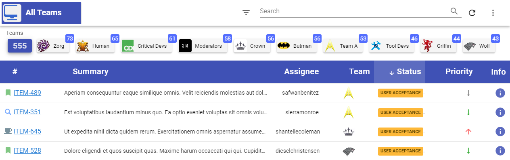
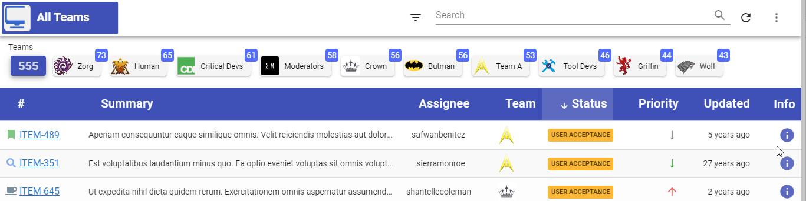

# Team Monitor Project

## Description
Some years ago created a side project from scratch to keep learn web technologies and improve my personal skills.

This project is a team monitor and as the name states it allows to track JIRA and QC items to improve team's response times.

As there are times that items just sit there for days and nobody have checked them. The department I used to work had ~130 cross cultural developers, testers, analysts and managers.
That made the sprints quite difficult to monitor and take action in time. 

## Technologies Used
- MySql
- Java Spring MVC
- VueJS2
- Vuetify

## Features
- light/dark theme

- configurable avatars
- dynamic filtering
- sorting columns
- search data
- opening details for each item

## Setup
- install MySQL 5.7
- create admin user for database
- encrypt user and password using `src/main/java/server/sec/ChangePassword.java`
- put both values in `src/main/java/resources/mysql5.properties`
- import dummy data (`src/main/java/resources/team_monitor_db.sql`) into database (using MySQL Workbench)
- install Java SDK 11.0.6
- download maven dependencies and re-build project
- configure ALM Quality Center settings, JIRA settings in `src/main/java/resources`
- install NPM dependencies in `src/main/java/webapp` (`npm ci` for faster install)
- run Jetty server and go to `http://localhost:8080`

## How to contribute?
Contact me through mail `vilde.andris@gmail.com` with suggestions.

## License
MIT License

Copyright (c) 2017 Andris Vilde

Permission is hereby granted, free of charge, to any person obtaining a copy
of this software and associated documentation files (the "Software"), to deal
in the Software without restriction, including without limitation the rights
to use, copy, modify, merge, publish, distribute, sublicense, and/or sell
copies of the Software, and to permit persons to whom the Software is
furnished to do so, subject to the following conditions:

The above copyright notice and this permission notice shall be included in all
copies or substantial portions of the Software.

THE SOFTWARE IS PROVIDED "AS IS", WITHOUT WARRANTY OF ANY KIND, EXPRESS OR
IMPLIED, INCLUDING BUT NOT LIMITED TO THE WARRANTIES OF MERCHANTABILITY,
FITNESS FOR A PARTICULAR PURPOSE AND NONINFRINGEMENT. IN NO EVENT SHALL THE
AUTHORS OR COPYRIGHT HOLDERS BE LIABLE FOR ANY CLAIM, DAMAGES OR OTHER
LIABILITY, WHETHER IN AN ACTION OF CONTRACT, TORT OR OTHERWISE, ARISING FROM,
OUT OF OR IN CONNECTION WITH THE SOFTWARE OR THE USE OR OTHER DEALINGS IN THE
SOFTWARE.
